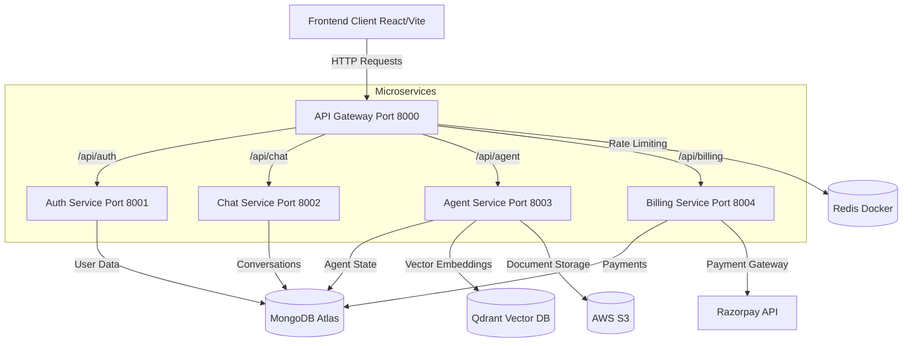

# Cortex AI

A sophisticated, microservices-based AI assistant web application featuring multi-provider AI chat, document analysis, RAG (Retrieval-Augmented Generation), vector search, and a built-in code editor. 

Built with modern web technologies, Cortex AI provides a scalable, secure, and performant platform for interacting with various LLMs (Large Language Models) while seamlessly handling authentication, billing, and document management.

---

## 🚀 Key Features

* **Advanced AI Chat:** Powered by Langchain and Langgraph, integrating multiple AI providers including Google GenAI, Groq, Deepseek, and OpenRouter.
* **Document Analysis & RAG:** Upload and analyze documents (PDF, PPTX). Utilizes Qdrant for vector embeddings and search.
* **Web Search Integration:** Real-time web search capabilities using Tavily to augment AI responses.
* **Integrated Code Editor:** Built-in Monaco Editor for an IDE-like coding experience directly within the app.
* **Secure Authentication:** Multi-provider authentication (Google, GitHub) handled via Firebase and Firebase Admin.
* **Robust Billing System:** Subscription and credit-based system integrated with Razorpay.
* **Microservices Architecture:** Highly scalable backend with an API Gateway routing to independent services (Auth, Chat, Agent, Billing).
* **Responsive UI:** Modern, dynamic interface built with React 19, Tailwind CSS v4, and Framer Motion.

---

## 🏗️ System Architecture

Cortex AI follows a microservices architecture pattern. The frontend communicates exclusively with an Express-based API Gateway, which handles routing, authentication middleware, and rate limiting (via Redis), before proxying requests to the appropriate backend service.



### Microservices Breakdown

1. **API Gateway (`gateway`)**: The central entry point. Handles request proxying, CORS, Helmet security, rate limiting (Redis), and JWT authentication middleware.
2. **Auth Service (`auth`)**: Manages user sessions, Firebase integration, and internal credit/plan updates.
3. **Chat Service (`chat`)**: Manages conversation history, message persistence, and retrieval.
4. **Agent Service (`agent`)**: The core AI engine. Handles AI model routing (Langchain), file parsing (Multer, PDFKit, PptxGenJS), vector database communication (Qdrant), cloud storage (AWS S3), and web search (Tavily).
5. **Billing Service (`billing`)**: Handles payment orders and verification via Razorpay.

---

## 💻 Tech Stack

### Frontend
* **Core:** React 19, Vite
* **Styling & Animation:** Tailwind CSS v4, Framer Motion, Lucide React, React Icons
* **State Management:** Redux Toolkit
* **Routing:** React Router DOM
* **Editor & Markdown:** Monaco Editor, React Markdown, React Syntax Highlighter, Remark GFM
* **Auth:** Firebase SDK

### Backend
* **Core:** Node.js, Express.js
* **Architecture:** Microservices, Express HTTP Proxy
* **Databases:** MongoDB (Mongoose), Redis (ioredis), Qdrant (Vector DB)
* **AI & NLP:** Langchain, Langgraph, Google GenAI, Groq, OpenRouter, Tavily
* **Cloud & Storage:** AWS S3 SDK, Multer
* **Third-Party Services:** Firebase Admin, Razorpay

---

## 📂 Project Structure

```text
cortex-ai/
├── backend/
│   ├── docker-compose.yml       # Redis setup
│   ├── gateway/                 # API Gateway Service
│   ├── services/
│   │   ├── agent/               # AI & RAG Engine Service
│   │   ├── auth/                # Authentication Service
│   │   ├── billing/             # Payment & Subscription Service
│   │   └── chat/                # Conversation History Service
│   └── shared/                  # Shared utilities (e.g., Redis client)
├── frontend/
│   ├── public/                  # Static assets
│   ├── src/                     # React source code
│   │   ├── assets/              
│   │   ├── components/          # Reusable UI components
│   │   ├── features/            # Feature-specific logic
│   │   ├── hooks/               # Custom React hooks
│   │   ├── pages/               # Application routes/pages
│   │   ├── redux/               # Redux store and slices
│   │   └── utils/               # Helper functions
│   ├── firebase.js              # Firebase configuration
│   ├── index.html
│   └── vite.config.js
└── README.md
```

---

## ⚙️ Prerequisites

* Node.js (v18 or higher recommended)
* Docker and Docker Compose (for Redis)
* MongoDB Atlas cluster or local MongoDB instance
* Accounts/API Keys for:
  * Firebase (Web Setup & Admin Service Account)
  * AWS (S3 Bucket)
  * Qdrant
  * Razorpay
  * AI Providers (Google, Groq, OpenRouter, Tavily)

---

## 🚀 Installation and Setup

### 1. Clone the repository
```bash
git clone <repository-url>
cd cortex-ai
```

### 2. Start Local Infrastructure (Redis)
Ensure Docker is running, then start the Redis container:
```bash
cd backend
docker-compose up -d
```

### 3. Install Dependencies
You need to install dependencies for the frontend, the gateway, and every microservice.

**Frontend:**
```bash
cd ../frontend
npm install
```

**Gateway:**
```bash
cd ../backend/gateway
npm install
```

**Services:**
```bash
# Run in each service directory (agent, auth, billing, chat)
cd ../services/agent && npm install
cd ../auth && npm install
cd ../billing && npm install
cd ../chat && npm install
```

---

## 🔑 Environment Variables

Create `.env` files in the respective directories. **Do NOT commit these files.**

### Frontend (`frontend/.env`)
| Variable | Description |
| :--- | :--- |
| `VITE_FIREBASE_API_KEY` | Firebase Web API Key (public client key) |
| `VITE_SERVER_URL` | API Gateway base URL (e.g. `http://localhost:8000`, `https://cortex-gateway.onrender.com`) |
| `VITE_RAZORPAY_KEY` | Razorpay Key ID used by the client checkout (public key) |

### API Gateway (`backend/gateway/.env`)
| Variable | Description |
| :--- | :--- |
| `PORT` | Gateway port (defaults to `8000`) |
| `FRONTEND_URL` | Frontend origin allowed for CORS |
| `REDIS_URL` | Redis connection URL |
| `MONGODB_URL` | MongoDB connection string (billing data lives here) |
| `AUTH_SERVICE` | URL of Auth service (e.g., `http://localhost:8001`) |
| `CHAT_SERVICE` | URL of Chat service |
| `AGENT_SERVICE` | URL of Agent service |
| `RAZORPAY_KEY_ID` | Razorpay API Key (billing is handled by the gateway) |
| `RAZORPAY_KEY_SECRET` | Razorpay API Secret |

### Agent Service (`backend/services/agent/.env`)
| Variable | Description |
| :--- | :--- |
| `PORT` | Agent service port (defaults to `8003`) |
| `MONGODB_URL` | MongoDB connection string |
| `REDIS_URL` | Redis connection URL (rate limiting + memory) |
| `CHAT_SERVICE` | URL of Chat service |
| `AUTH_SERVICE` | URL of Auth service |
| `GATEWAY_URL` | API Gateway URL (optional) |
| `GOOGLE_API_KEY` | Gemini API Key |
| `GROQ_API_KEY` | Groq API Key |
| `OPENROUTER_API_KEY` | OpenRouter API Key |
| `TAVILY_API_KEY` | Tavily Web Search API Key |
| `QDRANT_URL` | Qdrant cluster URL |
| `QDRANT_API_KEY` | Qdrant access key |
| `AWS_ACCESS_KEY_ID` | AWS IAM Access Key |
| `AWS_SECRET_ACCESS_KEY` | AWS IAM Secret Key |
| `AWS_REGION` | AWS Region |
| `AWS_BUCKET_NAME` | S3 Bucket Name |

### Auth Service (`backend/services/auth/.env`)
| Variable | Description |
| :--- | :--- |
| `PORT` | Auth service port (defaults to `8001`) |
| `MONGODB_URL` | MongoDB connection string |
| `FRONTEND_URL` | Client URL (e.g., `http://localhost:5173`) |
| `REDIS_URL` | Redis connection URL (session store) |
| `FIREBASE_SERVICE_ACCOUNT` | Firebase Admin service account as a JSON string (falls back to `serviceAccount.json`) |

### Chat Service (`backend/services/chat/.env`)
| Variable | Description |
| :--- | :--- |
| `PORT` | Chat service port (defaults to `8002`) |
| `MONGODB_URL` | MongoDB connection string |

All services support an optional `CUSTOM_DNS_SERVERS` (comma-separated) to override
the resolvers used to reach MongoDB/Redis when running in environments with
restricted DNS (e.g. some dev boxes). Never set it in normal cloud deployments.

> **Note:** The standalone Billing service (`backend/services/billing`) is no longer
> required — billing logic was merged into the API Gateway, which reads
> `RAZORPAY_KEY_ID` / `RAZORPAY_KEY_SECRET` directly.

---

## 🏃‍♂️ Running the Application

To run the application locally, you will need multiple terminal tabs/windows.

### Start the Frontend
```bash
cd frontend
npm run dev
```

### Start the Backend Services
In separate terminals, navigate to each backend directory and run the dev script:

**Gateway:**
```bash
cd backend/gateway
npm run dev
```

**Services:**
```bash
cd backend/services/auth && npm run dev
cd backend/services/chat && npm run dev
cd backend/services/agent && npm run dev
cd backend/services/billing && npm run dev
```

---

## 📡 API Endpoints (via Gateway)

All client requests should be routed through the API Gateway (default: `http://localhost:8000`).

**Auth (`/api/auth`)**
* `POST /login` - User login/authentication
* `GET /logout` - User logout
* `PATCH /internal/update-plan` - Update subscription plan (Internal)
* `PATCH /internal/deduct-credits` - Deduct usage credits (Internal)

**Chat (`/api/chat`)**
* `POST /create-conversation` - Initialize a new chat thread
* `GET /get-conversations` - Retrieve user's conversation history
* `POST /update-conversation` - Update conversation metadata
* `POST /save-message` - Save a new message
* `GET /get-messages/:id` - Get messages for a specific conversation

**Agent (`/api/agent`)**
* `POST /chat` - Main AI interaction endpoint (supports `multipart/form-data` with `file` field for document analysis)

**Billing (`/api/billing`)**
* `POST /create-order` - Initialize a Razorpay order
* `POST /verify-payment` - Verify payment signature

**Gateway specific:**
* `GET /api/me` - Get current authenticated user profile
* `GET /` - Gateway health check

---

## 🔮 Future Improvements

* Containerize all microservices using Docker for streamlined deployment.
* Implement Kubernetes manifests for orchestration and automatic scaling.
* Introduce a robust message broker (e.g., RabbitMQ or Kafka) for asynchronous inter-service communication instead of synchronous HTTP calls.
* Add comprehensive end-to-end testing with Cypress or Playwright.
* Set up a CI/CD pipeline using GitHub Actions for automated testing and deployment.
